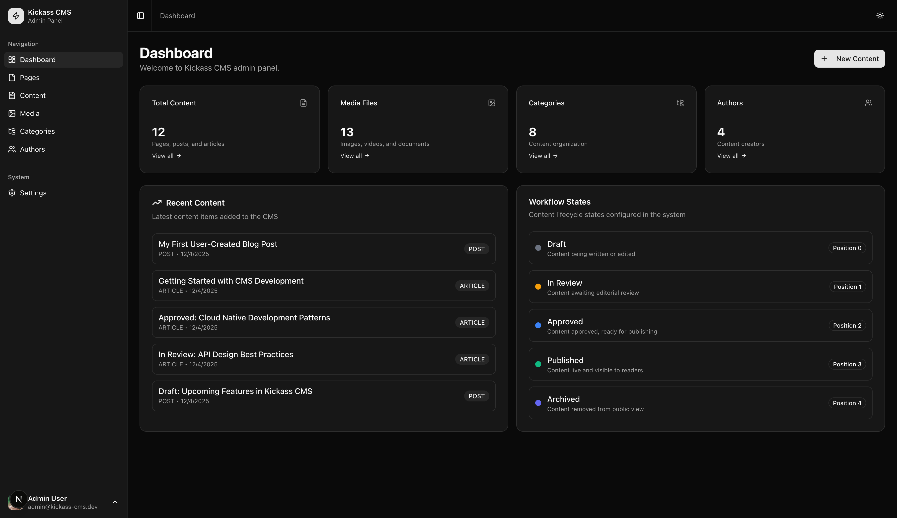
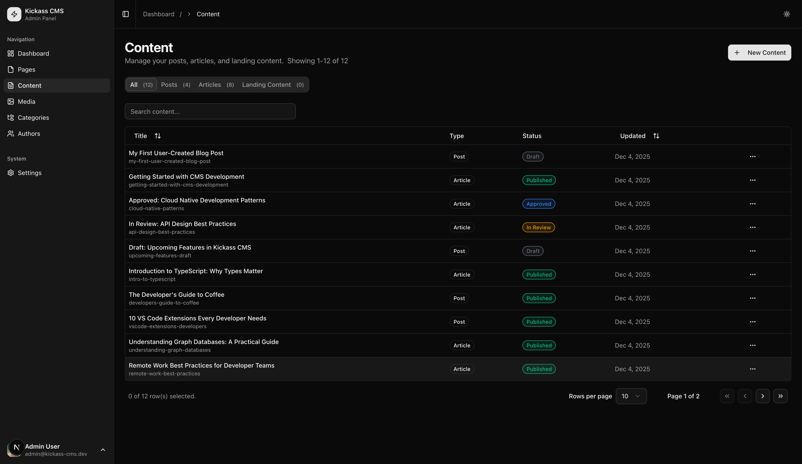
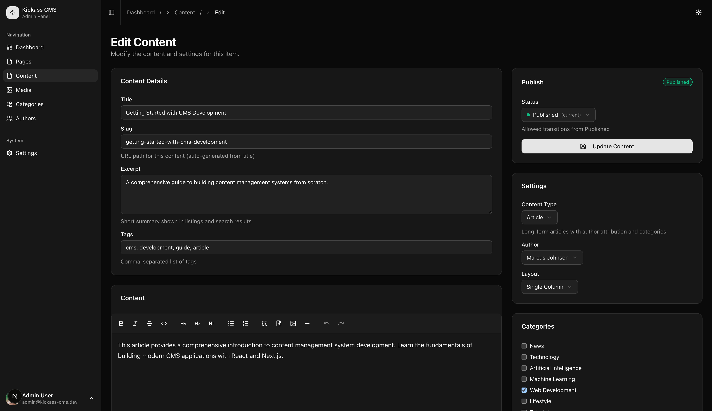
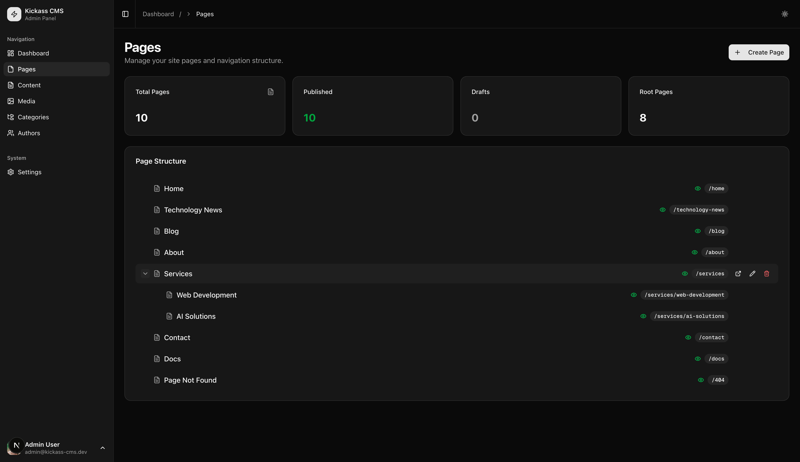
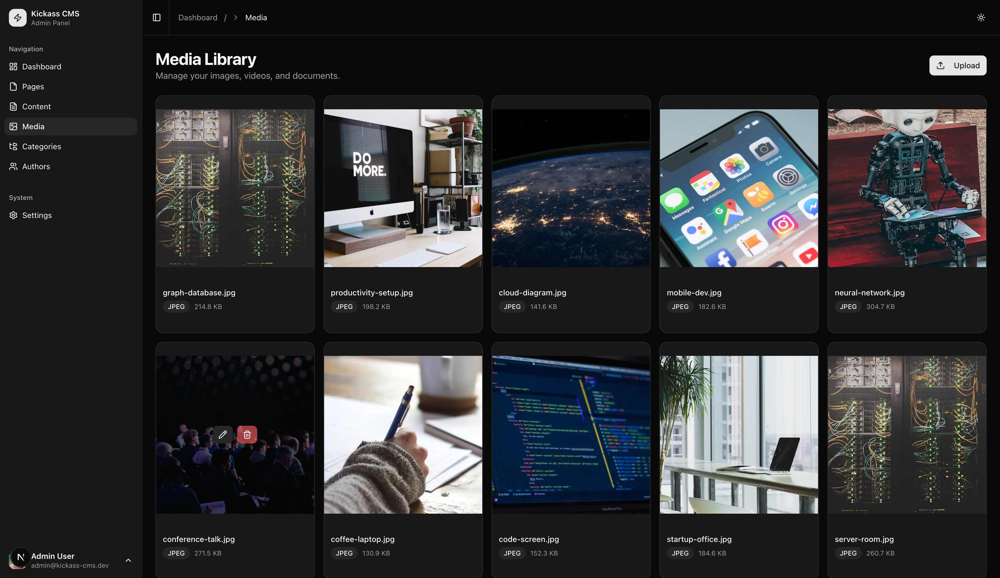

# Admin Interface Guide

This guide provides a visual walkthrough of the Kickass CMS admin interface.

## Accessing the Admin Panel

Navigate to `/admin` to access the admin panel. The interface is divided into:
- **Sidebar**: Navigation menu for all admin sections
- **Main content area**: Context-specific content and forms
- **Header**: Breadcrumbs, user info, and theme toggle

## Dashboard

The dashboard provides an overview of your CMS content and quick access to common actions.

### Dashboard Features

- **Stats cards**: Quick counts for content, media, categories, and authors
- **Recent Content**: Latest content items with type and date
- **Workflow States**: Current workflow configuration overview
- **New Content button**: Quick access to create new content

## Content Management

The Content section (`/admin/content`) is where you manage posts, articles, and landing content.

### Content List Features

- **Type tabs**: Filter by All, Posts, Articles, or Landing Content
- **Search**: Quick search across content titles
- **Sortable columns**: Click Title or Updated to sort
- **Status badges**: Color-coded workflow states (Draft, In Review, Approved, Published)
- **Pagination**: Navigate through large content lists

### Content Type Indicators

| Badge | Color | Meaning |
|-------|-------|---------|
| Draft | Gray | Work in progress |
| In Review | Yellow | Awaiting editorial review |
| Approved | Blue | Ready for publication |
| Published | Green | Live on public site |

## Content Editor

Click on any content item to open the editor (`/admin/content/[id]`).

### Editor Sections

#### Content Details (Left Panel)
- **Title**: Main content title
- **Slug**: URL-safe identifier (auto-generated)
- **Excerpt**: Short summary for cards and SEO
- **Tags**: Comma-separated list of tags

#### Block Editor
The Tiptap-powered editor with formatting toolbar:

| Button | Shortcut | Function |
|--------|----------|----------|
| **B** | Cmd+B | Bold text |
| *I* | Cmd+I | Italic text |
| ~~S~~ | - | Strikethrough |
| `</>` | - | Inline code |
| H1-H3 | - | Heading levels |
| List | - | Bullet/numbered lists |
| Quote | - | Blockquote |
| Code | - | Code block |
| Image | - | Insert image |
| Rule | - | Horizontal divider |

#### Publish Panel (Right)
- **Status dropdown**: Select workflow state
- **Allowed transitions**: Shows valid next states
- **Update Content button**: Save changes

#### Settings Panel (Right)
- **Content Type**: Post, Article, or Page
- **Author**: Select primary author
- **Layout**: Choose layout template

#### Categories Panel (Right)
Checkbox list of available categories. Select multiple categories to organize content.

#### Revisions Panel (Right)
View revision history showing:
- Revision number
- Timestamp
- Author
- Change message
- Restore option (for non-current revisions)

## Page Management

The Pages section (`/admin/pages`) shows the hierarchical page structure.

### Page Tree Features

- **Stats cards**: Total, Published, Drafts, Root pages counts
- **Hierarchical view**: Parent/child relationships with indentation
- **Expand/collapse**: Toggle child pages visibility
- **Path display**: Full URL path for each page
- **Quick actions**: View, Edit, Delete buttons

### Page Icons

| Icon | Meaning |
|------|---------|
| Folder | Page with children |
| Document | Single page (no children) |
| Green dot | Published |
| Gray dot | Draft |

## Media Library

The Media section (`/admin/media`) manages uploaded files.

### Media Features

- **Grid view**: Visual thumbnail gallery
- **Upload button**: Add new media files
- **File info**: Filename, type (JPEG, PNG, etc.), file size
- **Hover actions**: Edit and delete buttons on each item

### Supported File Types

| Type | Extensions | Use Case |
|------|------------|----------|
| Images | jpg, jpeg, png, gif, webp | Content images, featured images |
| Documents | pdf, doc, docx | Downloadable attachments |
| Video | mp4, webm | Embedded video content |

## Keyboard Shortcuts

The admin interface supports keyboard navigation:

| Shortcut | Action |
|----------|--------|
| Cmd/Ctrl + K | Open command palette |
| Cmd/Ctrl + S | Save current form |
| Cmd/Ctrl + B | Bold (in editor) |
| Cmd/Ctrl + I | Italic (in editor) |
| Cmd/Ctrl + Z | Undo (in editor) |
| Cmd/Ctrl + Shift + Z | Redo (in editor) |

## Theme Toggle

Click the sun/moon icon in the header to toggle between light and dark themes. Your preference is saved in local storage.

## Related Documentation

- [Content Management](content-management.md) - Content types and workflow
- [Revision System](revision-system.md) - Version history details
- [Page System](page-system.md) - Page sections and filtering

