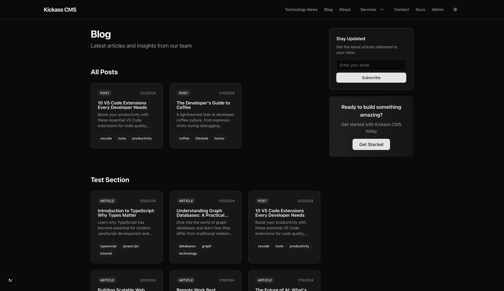
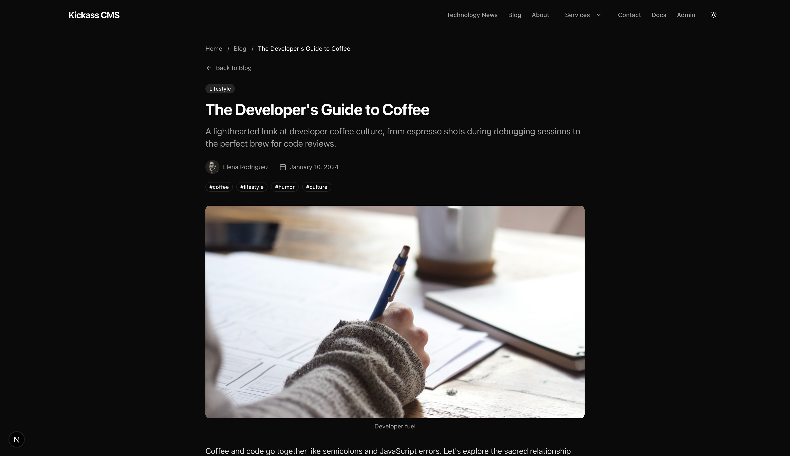
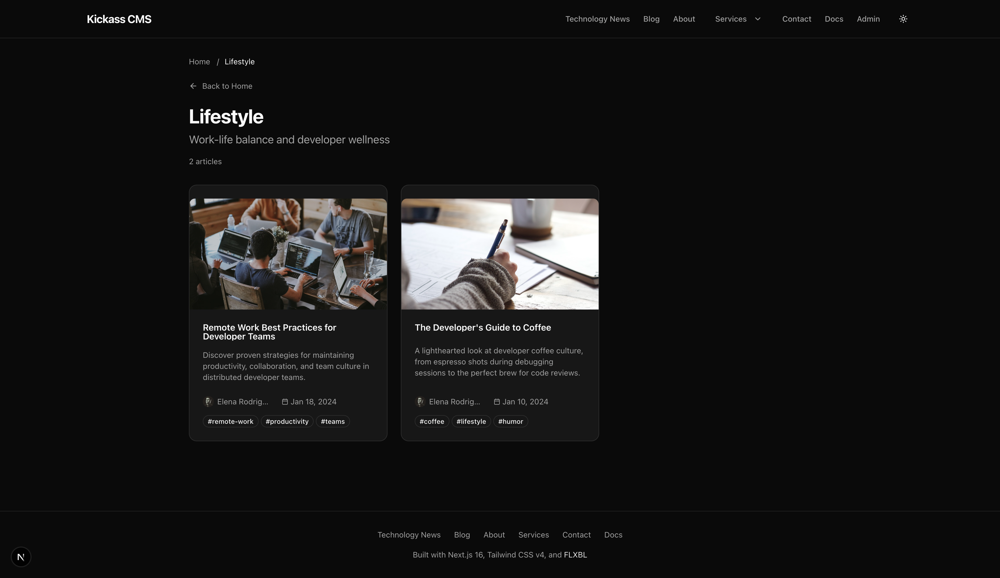

# Public Site & URL Routing

This guide covers how content appears on the public-facing website, URL patterns, and archive pages.

## Public Site Overview

The public site displays published content with a consistent layout including:
- Site header with navigation
- Main content area
- Footer with quick links



## URL Routing

### Content URLs

| Content Type | URL Pattern | Example |
|--------------|-------------|---------|
| Posts | `/blog/[slug]` | `/blog/developers-guide-to-coffee` |
| Articles | `/articles/[slug]` | `/articles/intro-to-typescript` |
| Pages | `/[...path]` | `/about`, `/services/consulting` |

### Archive URLs

| Archive Type | URL Pattern | Example |
|--------------|-------------|---------|
| Category | `/category/[slug]` | `/category/technology` |
| Author | `/author/[id]` | `/author/abc123` |
| Tag | `/tag/[tag]` | `/tag/javascript` |

### Special Routes

| Route | Purpose |
|-------|---------|
| `/` | Home page |
| `/posts` | Blog listing (redirects to `/blog`) |
| `/404` | Custom 404 error page |

## Single Content Page

Individual content pages display the full article with metadata.



### Content Page Elements

- **Breadcrumb navigation**: Path back to parent sections
- **Back link**: Return to listing page
- **Category badge**: Clickable link to category archive
- **Title and excerpt**: Content header information
- **Author card**: Avatar, name (links to author archive)
- **Published date**: When content was published
- **Tags**: Clickable links to tag archives
- **Featured image**: With optional caption
- **Content blocks**: Rendered article content
- **Author bio**: About the author section at bottom

### Block Rendering

Content blocks are rendered with appropriate styling:

| Block Type | Rendering |
|------------|-----------|
| Paragraph | Standard text with formatting |
| Heading | H1-H6 with anchor links |
| Image | Responsive image with caption |
| Blockquote | Styled quote with attribution |
| Code | Syntax-highlighted code block |
| List | Ordered or unordered items |
| Callout | Styled info/warning/error box |

## Category Archives

Category pages show all content in a specific category.



### Category Archive Features

- **Breadcrumb**: Home > Category name
- **Category title**: With description from category settings
- **Content count**: "N articles" indicator
- **Content cards**: Grid of content items with:
  - Featured image
  - Title (linked)
  - Excerpt
  - Author avatar and name
  - Published date
  - Tag list

### Category Hierarchy

Categories can be hierarchical:
```
Technology
├── Web Development
│   ├── Frontend
│   └── Backend
└── Mobile Development
```

Child category URLs follow the parent: `/category/web-development`

## Author Archives

Author pages show all content by a specific author.

### Author Archive Elements

- Author avatar and name
- Bio text
- Social links (if configured)
- List of all published content

## Tag Archives

Tag pages show content with a specific tag.

### Tag Behavior

- Tags are freeform text (no pre-defined list)
- Tag archives are created on-demand
- URL-encoded for special characters
- Case-insensitive matching

## Navigation

### Header Navigation

Pages with `showInNav: true` appear in the site header.

Navigation features:
- Dropdown menus for pages with children
- Current page highlighting
- Admin link (for authenticated users)
- Theme toggle

### Footer Navigation

The footer includes links to key pages, usually matching the header navigation plus additional links like privacy policy, terms, etc.

## Content Cards

Content is displayed in card format on listing pages:

| Element | Source |
|---------|--------|
| Image | Featured image from `HAS_MEDIA` relationship |
| Type badge | `contentType` field (POST, ARTICLE) |
| Date | `publishedAt` timestamp |
| Title | `title` field (linked to content) |
| Excerpt | `excerpt` field |
| Tags | `tags` array (linked to tag archives) |

## Sidebar Components

Some pages include sidebar widgets:

### Newsletter Signup
- Email input field
- Subscribe button
- (Disabled in demo mode)

### CTA Block
- Heading text
- Description
- Action button

## SEO Features

### Meta Tags

Each page automatically includes:
- `<title>` from content title
- `<meta name="description">` from excerpt
- Open Graph tags for social sharing

### Structured Data

Content pages include JSON-LD structured data for:
- Article schema
- Author information
- Published/modified dates

## Static Generation

### Build-Time Rendering

Content pages are statically generated at build time for optimal performance:
- Posts: Pre-rendered based on published content
- Articles: Pre-rendered based on published content
- Pages: Pre-rendered based on published pages

### Dynamic Routes

The catch-all route `/[...path]` handles:
- Custom page paths from the Page system
- Nested page hierarchies
- 404 fallback for unknown paths

## Related Documentation

- [Content Management](content-management.md) - Creating content
- [Page System](page-system.md) - Building pages with sections
- [Developer Guide](developer-guide.md) - Technical implementation

